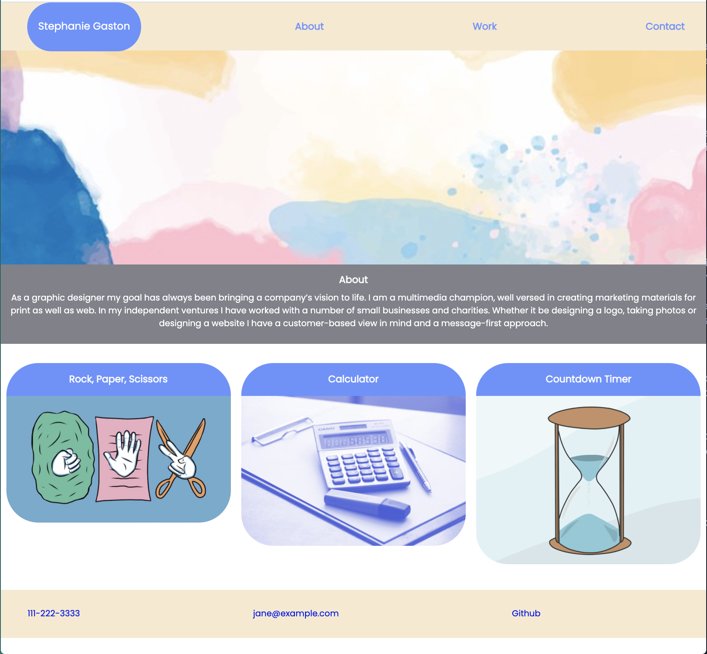

# Portfolio_Homework_2
Second assignment creating a portfolio using flexbox, media queries and css variables

## Goal:
The goal was to create a website and css from scratch utilizing the advaced css skills we learned in class.

## Issues:
- Unsure as to why my headshot would not show up. 

- More review is required of flexbox and media queries. How the properties are based off parent elements is challenging when you have multiple 

## Results:

## Summary:
This assignment was challenging. It showed me where the gaps in my knowledge are. Although I do have a deeper understanding of CSS I know I need to work on media queries and flexbox more.

## Table of Contents
If your README is long, add a table of contents to make it easy for users to find what they need.
- [Goal](#Goal)
- [Issues](#Issues)
- [Results](#Results)
- [Summary](#Summary)

_____
### License
MIT License, Copyright (c) [2021] [StephanieGaston]